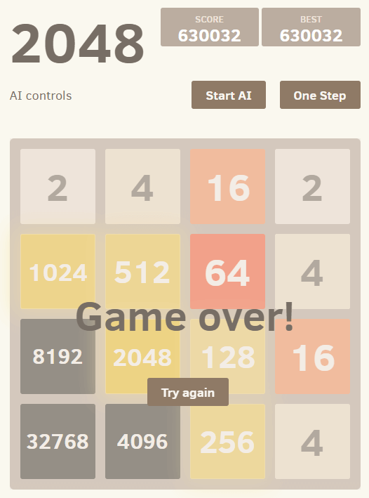

# 2048 AI
 An AI made for the game 2048.
 The AI can reach 16384 most of the time and sometimes even reach 32768.

 The AI reached the 32768 tile in the browser version after 5 attempts and achieved the score of 630032. Below is the screenshot of that game.

 

## Algorithm
 This AI is an Expectimax search run in parallel on your browser without any back-end server or browser control, so you can even run it on a mobile device.

 The AI uses 4 web workers, each is a WebAssembly module compiled from C++ with Emscripten to perform the Expectimax search for each move available. The move with the highest result is chosen.
 Because the search is done in parallel and the workers use heavy optimizations like bitboard representation, lookup tables, the AI can search very deep in a short amount of time (default search depth is 7).

## Benchmark (Console application, Intel® Core™ i5-8300H Processor)
 | Depth  | Games | Score  | % 32768 | % 16384 | % 8192 | % 4096 | Time | Moves/s |
 |--------|-------|--------|---------|---------|--------|--------|------|---------|
 | 3 ply  | 1000  | 216159 | 0.8     | 43      | 85.4   | 98.1   | 3s   | 2343    |
 | 5 ply  | 300   | 283720 | 2       | 66.33   | 96     | 100    | 17s  | 648     |
 | 7 ply  | 100   | 353368 | 12      | 85      | 98     | 100    | 87s  | 158     |

## Features
 - 64-bit Bitboard representation.
 - Table lookup for movement and evaluation.
 - Iterative deepening based on posistion.
 - Top level parallelism (web version only).
 - Prune nodes with low probability.
 - Dynamic probability threshold.
 - 80MB transposistion table with Zobrist Hash. (320MB on the web version)

## Heuristic
 Heuristics not only increase the strength of the AI but also direct the AI into positions that can be evaluated faster, which'll increase the speed of the AI significantly. I came up with new heuristics for the evaluation function such as smoothness (making the board easier to merge), floating tiles (preventing flat boards),... but I can't tune the weights using mathematical optimization so I used the same heuristics from [this AI](https://github.com/nneonneo/2048-ai).

## Usage
 I recommend using the AI in a linux environment.
 
 If you use Windows open Developer Command Prompt for Visual Studio and use the command **nmake** to compile the code or **nmake web** to compile the web version.

### Console application
 The console application has almost no visualization of the game and should be used only for benchmarking purpose. See the web version [below](#web-version).

 How to build:
```sh
make
```

 Run parameters:
 + **-d [Depth]** - The search depth (1->4). Default: 1, every depth is 2 ply + initial call so 1 is 3 ply and 3 is 7 ply.
 + **-i [Iterations]** - Number of games to play for batch testing purpose. Default: 1.
 + **-p** -Show detailed progress of the game. **Could reduce performance!**

 Example:
```sh
./2048 -d 3 -p #Play 1 game with search depth of 3 (7 ply) with detailed progress
./2048 -i 100 #Play 100 games with search depth of 1 (3 ply)
```
 After running the AI you can see the result in result.csv with any spreadsheet viewer (for example MS Excel).

### Web version
 You can go to [this web page](https://ziap.github.io/2048-wasm) to run the AI.

 If you want to edit the search parameters or change the evaluation function, you need to set up Emscripten first, you can download it [here](https://emscripten.org/docs/getting_started/downloads.html).
 
 Compile the web version using this command:
```sh
make web
```
 Then you can test the AI by running it on a web server. The simplest way is to make a simple python http server:
```bat
python -m http.server 8080
```
 and access the AI via http://localhost:8080. You can change 8080 to any port number.

## Protential Improvements
 - Retune evaluation function with CMA-ES.
 - Use TD Learning to train a n-tuple network for evaluation.

# License
 This app is licensed under the MIT license.
